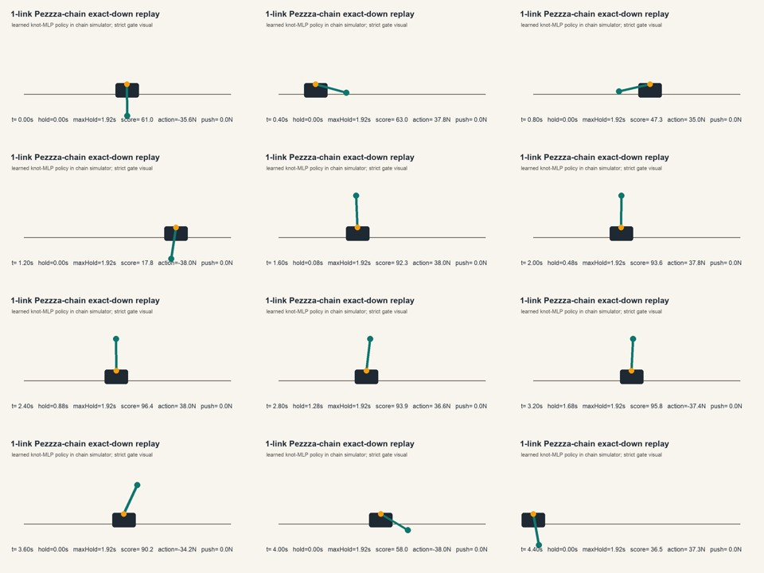
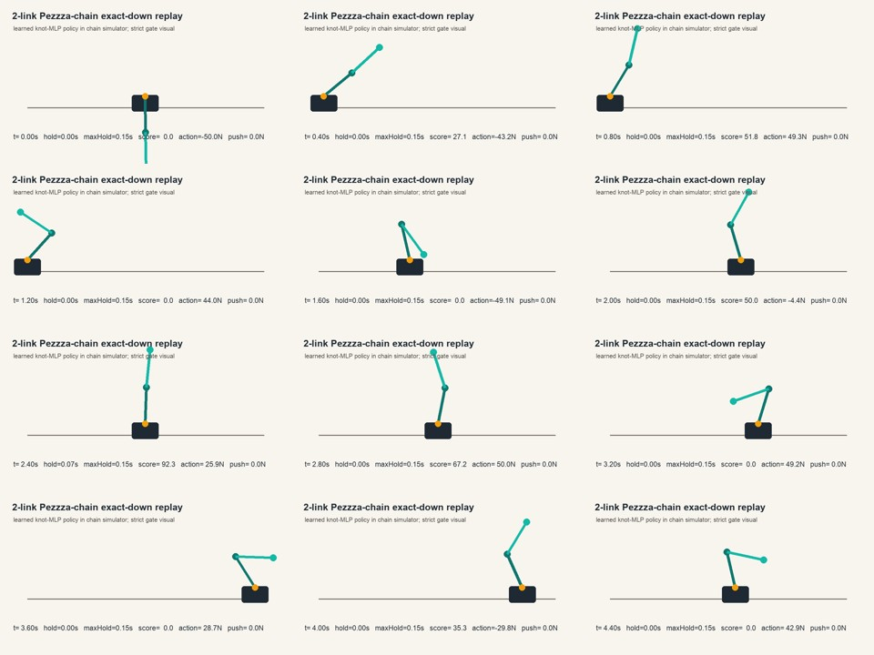
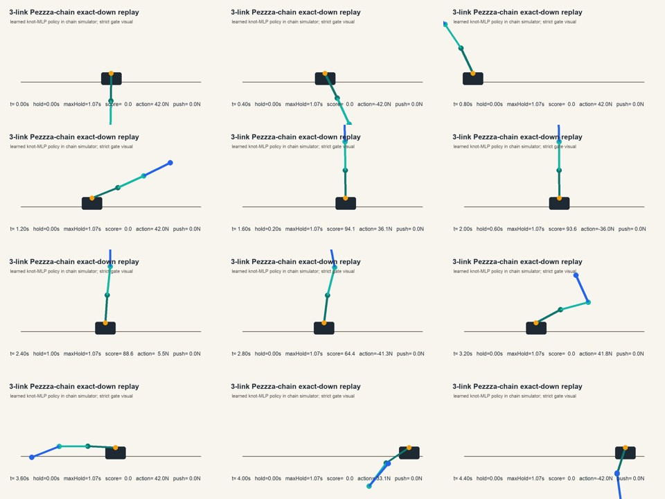
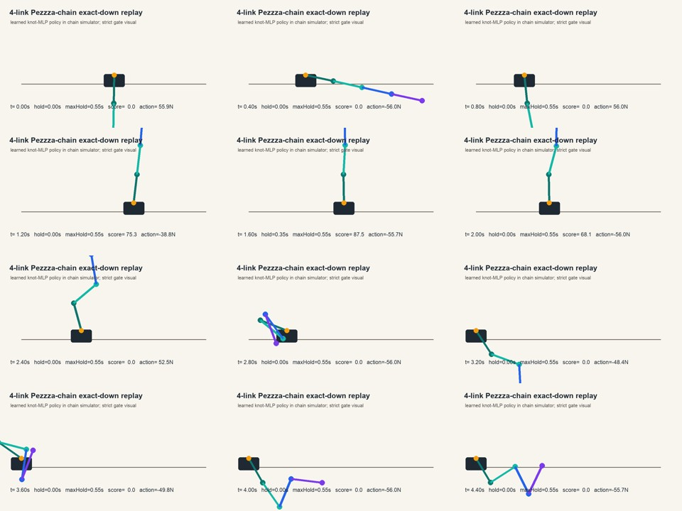
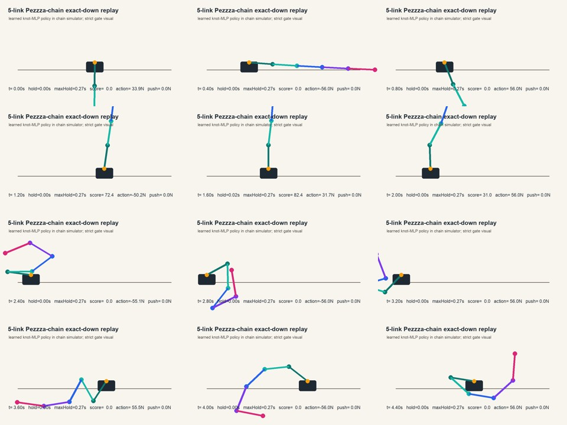
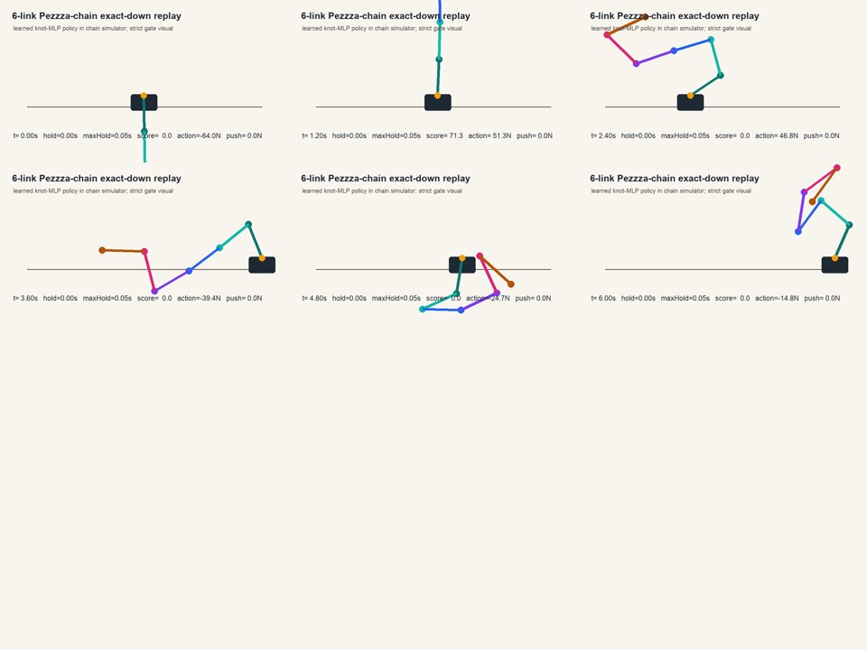

# Six Pendulum Per-Link Image Ledger

Date: 2026-06-12

Gate: exact down-start learned policy, no manual force, at least 1.000 seconds continuous strict upright hold in renderer replay. Trainer-only numbers are diagnostic when renderer replay disagrees.

## Summary

| Links | Renderer hold | Status | Image |
| --- | ---: | --- | --- |
| 1 | 1.917s | solved nominal | [image](../public/ailab/six-pendulum/link-status/link-1-solved-nominal-20260612.jpg) |
| 2 | 0.783s | not solved | [image](../public/ailab/six-pendulum/link-status/link-2-renderer-fail-20260612.jpg) |
| 3 | 1.067s | solved nominal | [image](../public/ailab/six-pendulum/link-status/link-3-solved-nominal-20260612.jpg) |
| 4 | 0.683s | not solved | [image](../public/ailab/six-pendulum/link-status/link-4-active-boundary-20260612.jpg) |
| 5 | 0.467s old / 0.317s new lineage | not solved | [image](../public/ailab/six-pendulum/link-status/link-5-not-solved-20260612.jpg) |
| 6 | 0.183s | not solved | [image](../public/ailab/six-pendulum/link-status/link-6-not-solved-20260612.jpg) |

## Link 1

Status: solved nominal. Next task is stabilization and disturbance recovery.

## Link 2

Status: not solved. Trainer reported more than one second in some runs, but renderer replay reached only 0.783s. This is the main trainer-versus-renderer drift example and is why renderer gate is mandatory.

## Link 3

Status: solved nominal. Robustness is not solved; disturbance gate failed and should be treated as the next task after nominal proof.

## Link 4

Status: not solved. This is the active failure boundary. Reverse-hold replay improved catch quality, but did not extend strict hold past one second.

## Link 5

Status: not solved. Do not promote this lane until four-link exact-down passes the one-second renderer gate.

## Link 6

Status: not solved. Current six-link artifacts are still early nominal progress, not proof.

